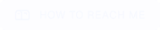

<!-- 1. HERO BANNER -->

 

<!-- 2. GREETING & SOCIALS -->
<table width="100%" style="border: none; border-collapse: collapse;">
  <tr style="border: none;">
    <!-- Export this serif header from Figma to maintain the standard Playfair typeface -->
    <td width="80%" style="border: none;" valign="middle">
      
      
    </td>
    <td width="20%" align="right" style="border: none;" valign="middle">
       &nbsp;
       &nbsp;
      
    </td>
  </tr>
</table>

<!-- INTRO TEXT -->

<b>I'm Marais Roos.</b> I am a "Designer who Codes" based in South Africa. I specialize in the design-to-development handoff, ensuring high-fidelity Figma prototypes are translated into pixel-perfect, responsive code.

 

<!-- 3. ABOUT ME SECTION -->

<table width="100%" style="border: none; border-collapse: collapse;">
  <tr style="border: none;">
    <!-- LEFT COLUMN: PILL TAGS -->
    <td width="30%" valign="top" style="border: none;">
       
        
        
        
        
        
        
      
    </td>
    
  <!-- RIGHT COLUMN: TEXT -->
  <td width="70%" valign="top" style="border: none;">
    
Sunt ut ut enim modi voluptas voluptas quod voluptatibus. Ut et voluptate aut inventore nam non. Et libero et labore accusamus molestiae perspiciatis numquam officia aut. Dicta explicabo et ex ipsa aliquam consectetur voluptatem mollitia. Saepe modi dolorem ut inventore dolores reprehenderit nemo debitis. Est vero eum sunt reiciendis.

     
    
Qui ea voluptatem et id vero dolores natus et quasi. Mollitia quia deserunt. Doloribus aut facere consequuntur nihil occaecati eveniet. Voluptas non qui veritatis. Velit explicabo non. Et nihil quos consectetur recusandae exercitationem aut magnam qui voluptatem.

     
    
Sit quia minus autem ad rem. Est veritatis suscipit aut reprehenderit dolor sint quaerat expedita. Voluptates temporibus sapiente consectetur accusamus dolor excepturi. Quidem qui eum neque non necessitatibus dolore mollitia ea culpa. Ipsam enim ratione numquam sunt.

     
    
Deleniti natus sed officia. Voluptatem sit dolor sunt rem nam reprehenderit non et earum. Facere at quo. Aliquam cupiditate est. Dignissimos consequatur iusto repudiandae laborum nulla omnis minima vero.

     
    
Sint voluptas qui impedit sed enim. Et sunt ut quia consectetur qui. Voluptas ut numquam alias accusamus officia sit officia consequatur.

     
    
Atque et itaque praesentium earum et nemo. Doloremque sapiente et non qui. Eos sed cupiditate minima commodi. Iure soluta fuga sit a.

     
    
Veritatis ipsa dolorem dignissimos numquam aliquam quis quam sit. Placeat aut nemo. Iste minima est soluta eum perferendis laborum. Iusto magni ullam voluptates cupiditate aspernatur suscipit. Delectus possimus aut.

  </td>
  </tr>
</table>

 

<!-- 4. TECH STACK SECTION -->

<table width="100%" style="border: none; border-collapse: collapse; text-align: left;">
  <tr style="border: none;">
    <td width="33%" style="border: none; text-transform: uppercase;">
      
Designing & Prototyping

    </td>
    <td width="34%" style="border: none; text-transform: uppercase;">
      
Front-End Development

    </td>
    <td width="33%" style="border: none; text-transform: uppercase;">
      
Tools & Workflow

    </td>
  </tr>
  <tr style="border: none;">
    <td style="border: none;">
      <!-- Export tools with transparent backgrounds -->
       &nbsp;
      
    </td>
    <td style="border: none;">
       &nbsp;
       &nbsp;
       &nbsp;
      
    </td>
    <td style="border: none;">
       &nbsp;
       &nbsp;
       &nbsp;
      
    </td>
  </tr>
</table>

 

<!-- 5. GITHUB STATS SECTION -->

 
<!-- Drop your vercel app stat cards here in a standard side-by-side div or table -->